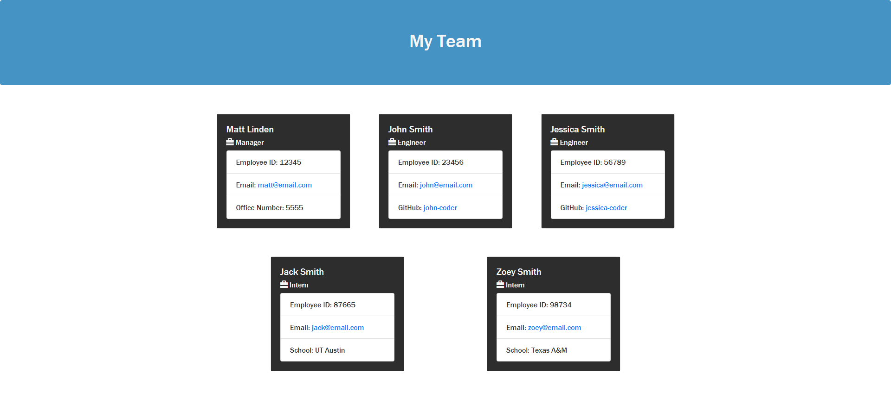

# Team-Profile-Generator

  ## Table of Contents
  * [Description](#description)
  * [Installation Instructions](#installation-instructions)
  * [Usage](#usage)
  * [Licensing](#licensing)
  * [Contribution Guidelines](#contribution-guidelines)
  * [Tests](#tests)
  
  ## Description
  This application will take user input from the command line to build a quick and effective team profile web page.
    

  ## Installation Instructions
  Download the application at: https://github.com/geocode-matt/Team-Profile-Generator.

  ## Usage
  Initialize the application by typing 'node index' in the command line. Answer the prompted questions to fill out your team profile. Upon completion of the prompts, the application will build an index.html file in the /dist directory.

  Tutorial/Walkthrough Video: https://drive.google.com/file/d/1pkzlIkj5BteXCZTi_WLqc4plBoq6xK1h/view
  
  ## Licensing
  This project is unlicensed.

  ## Contribution Guidelines
  Please email the project owner (mlindenx@email.com) for contribution information. 

  ## Tests  
  Please run 'npm run test' in the command line to view tests.

  ## Questions
  Please send any questions/concerns/comments to: mlindenx@gmail.com
